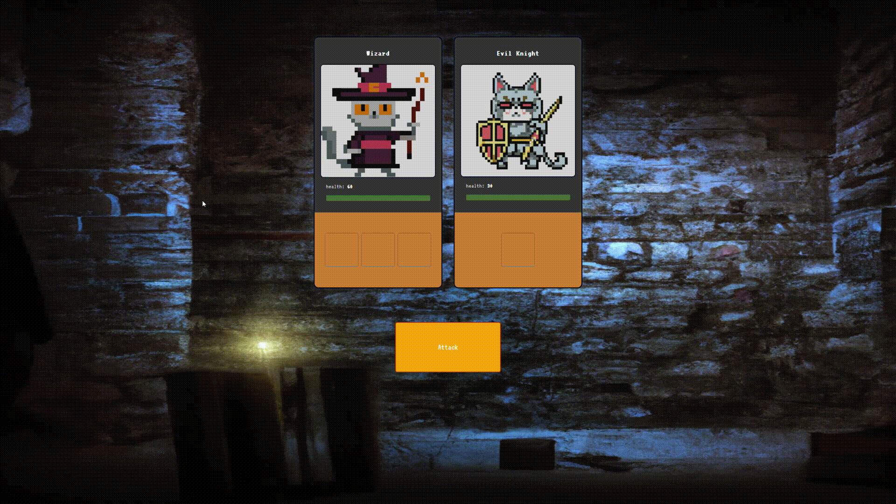

````markdown
# Cat Heros RPG

The Heros Cat Heros RPG Game is a simple web-based game where a hero battles against various evil monsters. The game allows the player to attack monsters using dice rolls and calculates the health points of the hero and monsters accordingly. The game ends when either the hero or all the monsters are defeated.

## Preview

## Technologies Used

- HTML
- CSS
- JavaScript

## Installation

1. Clone the repository:

   ```bash
   git clone https://github.com/walterhart/heros-rpg.git
   ```
````

Launch a local development server to run the game. You can use a tool like Live Server in Visual Studio Code or any other development server of your choice.

If you're using Visual Studio Code with the Live Server extension installed:

    -Right-click on the index.html file.
    -Select "Open with Live Server" to launch the game in your web browser.

If you're using a different development server, follow the appropriate steps to start the server and open the index.html file in your web browser.

Note: Running the game using a local development server is required to avoid any CORS (Cross-Origin Resource Sharing) issues.

Play the game in your web browser. 2. Open the project directory:

3. Open the `index.html` file in your web browser.

## How to Play

1. When the game starts, you will see a hero character and a monster character on the screen.

2. Click the "Attack" button to initiate an attack.

3. The hero and the monster will roll dice to determine the damage inflicted.

4. The health points of the hero and the monster will be updated based on the attack scores.

5. The game continues until either the hero or all the monsters are defeated.

6. If the hero's health reaches 0, the game ends, and the monster wins.

7. If all the monsters are defeated, the game ends, and the hero wins.

## Customization

- To customize the characters and their attributes, update the `characterData` object in the `data.js` file.

- You can modify the visual styles of the game by updating the CSS in the `style.css` file.

## Planned Features

I plan on adding more features to the game in my spare time. Some of the planned features include:

- Dice roll animation to enhance the visual experience.
- Additional types of attacks with different effects.
- More hero characters with unique abilities.
- Sound effects and background music to add audio immersion.
- Animation effects for character movements and actions.

```
